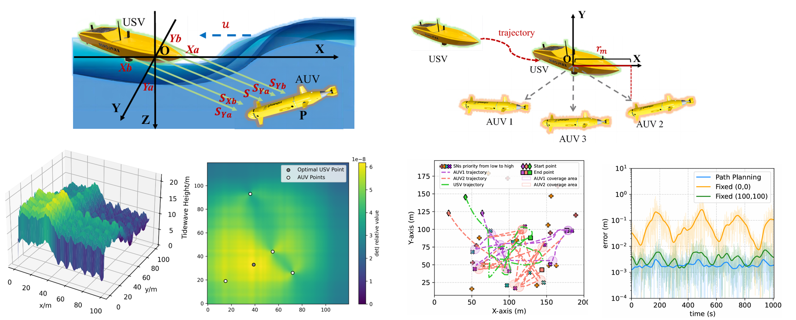

# [ICASSP 2025] USV-AUV-colab

[](https://arxiv.org/abs/2409.02444)  [](https://github.com/360ZMEM/USV-AUV-colab/blob/main/paper/SUPP.pdf) [](https://360zmem.github.io/USV-AUV-Colab)

This repository contains python code implementation of the paper "USV-AUV Collaboration Framework for Underwater tasks under Extreme Sea Conditions". 

Plese feel free to contact [@360ZMEM](mailto:gwxie360@outlook.com)(Guanwen Xie) if you encounter issues on this project.



# Get Started

Run this command to install the dependencies:

```bash
pip install -r requirements.txt
```

Run this command to train the TD3(DDPG) agents:

```bash
python train_td3.py # TD3
```

# System Model

This Python file includes the relevant classes and functions for calculating tide waves and USBL positioning. You can run this command to test and visualize the tide wave and evaluate the positioning results produced using cross-shaped hydrophones when the USV is positioned at the origin of the coordinates.

```bash
python tidewave_usbl.py
```

This Python file includes the environment simulation code and functions for USV-AUV collaboration. Execute this Python file to test the USV-AUV collaboration and visualize the Fisher determinant value and the optimal USV position.

```bash
python colab.py
```

# Evaluation & Figure

Subsequently, execute this command to perform the simulation using the trained policies, generating the USV/AUV trajectories and the AUV tracking error:

```bash
python eval_td3.py
```

Finally, execute this command to generate the figures of the trajectories and tracking error, similar to Fig. 4(a) and Fig. 4(b) in the original paper.

```bash
python fig_draw_example/draw_trajectory.py #draw trajectories of AUVs and USV, fig4a
python fig_draw_example/draw_tracking_error.py #fig4b
```

# Cite

If you find it useful for your work please cite:

```bibtex
@INPROCEEDINGS{10888444,
  author={Xu, Jingzehua and Xie, Guanwen and Wang, Xinqi and Ding, Yimian and Zhang, Shuai},
  booktitle={ICASSP 2025 - 2025 IEEE International Conference on Acoustics, Speech and Signal Processing (ICASSP)}, 
  title={USV-AUV Collaboration Framework for Underwater Tasks under Extreme Sea Conditions}, 
  year={2025},
  volume={},
  number={},
  pages={1-5},
  keywords={Training;Codes;Collaboration;Data collection;Signal processing;Robustness;Path planning;Speech processing;Optimization;Surface treatment;Autonomous underwater vehicle;Unmanned surface vehicle;Fisher information matrix;Reinforcement learning;Extreme sea conditions;Underwater tasks},
  doi={10.1109/ICASSP49660.2025.10888444}}
```

