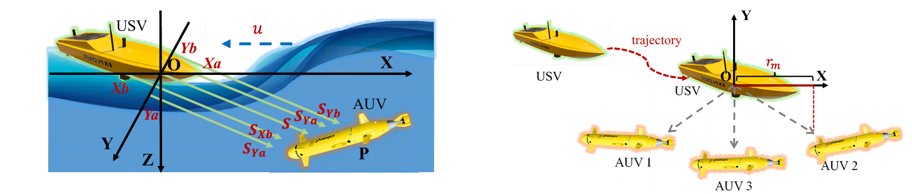

# USV-AUV-colab
Python implementation of the paper "USV-AUV Collaboration Framework for  Underwater tasks under Extreme Sea Conditions".



# Usage

Run this command to install the dependencies:

```bash
pip install -r requirements.txt
```

To test the simulation of extreme sea conditions and USBL positioning, please run:

```bash
python tidewave_usbl.py
```

Then run this command to train TD3(DDPG) or SAC agents:

```bash
python train_td3.py # TD3
```


